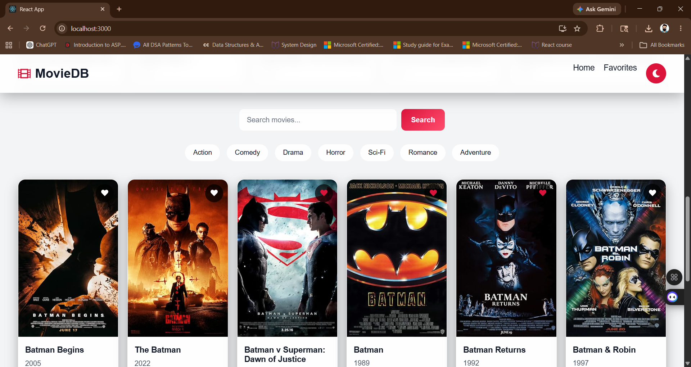
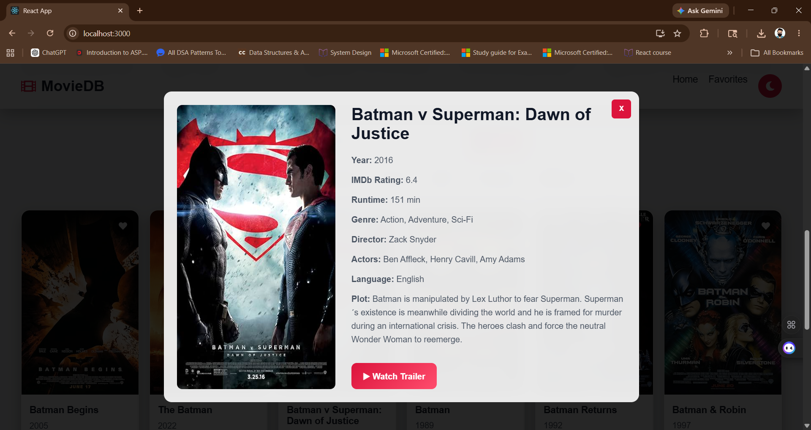
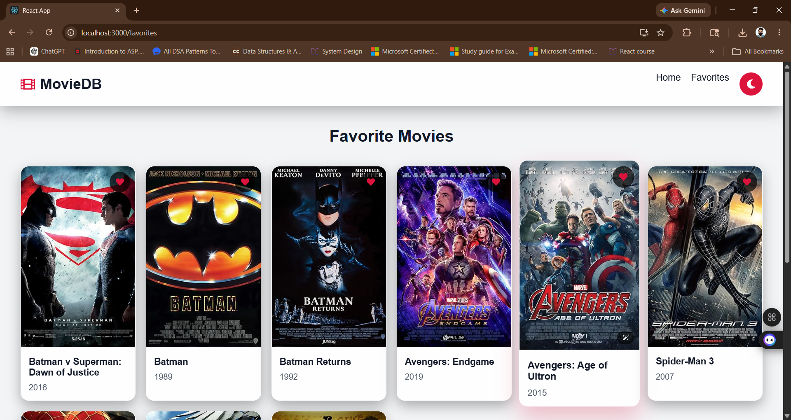

# 🎬 Movie Database Interface

A modern React movie database application built using the OMDb API.

## 🚀 Live Demo

https://movie-database-interface-nine.vercel.app/

---

## ✨ Features

- 🔍 Movie Search
- 🎞 Trending Movies Carousel
- ❤️ Favorites System
- 🌙 Dark / ☀️ Light Theme
- 🎬 Trailer Search
- 📱 Fully Responsive Design
- ⚡ Framer Motion Animations
- 🎥 Movie Details Modal
- 🔄 Auto-scrolling Trending Section
- 💾 localStorage Persistence

---

## 🛠 Tech Stack

- React.js
- React Router DOM
- Axios
- Framer Motion
- OMDb API
- CSS3

---

## 📸 Screenshots

### Home Page



### Movie Details Modal



### Favorites Page



---

## ⚡ Installation

```bash
npm install
npm start
```

---

## 🌐 API Used

OMDb API

https://www.omdbapi.com/

---

## 👨‍💻 Author

Vikas Yadav